# Game Churn Prediction AI — Intelligent Player Churn Prediction and Agentic Game Engagement Optimization System

This architecture illustrates the end-to-end pipeline of the Game Churn Prediction AI system, including data preprocessing, model selection, churn prediction, feature importance analysis, and agentic AI-based engagement strategy generation.

## Architecture Diagram

```mermaid
flowchart LR

    %% --------------------------------------------------
    %% LAYER DEFINITIONS
    %% --------------------------------------------------

    subgraph User_Interface [User Interface Layer]
        direction TB
        UI1[File Upload]
        UI2[Streamlit UI]
        UI3[Model Selection]
        UI4[Prediction Request]
    end

    subgraph Application_Layer [Application Layer]
        direction TB
        APP1[Data Preprocessing & Validation]
        APP2[Feature Engineering]
        APP3[Prediction Controller]
    end

    subgraph Machine_Learning_Layer [Machine Learning Layer]
        direction TB
        ML1{Model Selection}
        ML2[Random Forest Model]
        ML3[Logistic Regression Model]
        ML4[Selected Model]
        ML5[Prediction]
        ML6[Feature Importance Extraction]
    end

    subgraph Agentic_AI_Layer [Agentic AI Layer]
        direction TB
        AI1[Agentic AI Assistant]
        AI2[Engagement Agent]
        AI3[(Knowledge Base: strategies.json)]
        AI4[Strategy Selection Engine]
    end

    subgraph Reporting_Layer [Reporting & Output Layer]
        direction TB
        OUT1[Report Generator]
        OUT2[Display Predictions]
        OUT3[Download CSV]
        OUT4[Download PDF]
    end

    %% --------------------------------------------------
    %% DATA FLOW
    %% --------------------------------------------------

    %% User Interaction & Processing Flow
    UI1 -- CSV Upload --> APP1
    UI2 --> UI3
    UI2 --> UI4
    
    APP1 --> APP2
    APP2 --> APP3
    APP3 --> ML1

    %% Model Selection
    UI3 -.-> ML1
    ML1 --> ML2
    ML1 --> ML3
    ML2 --> ML4
    ML3 --> ML4

    %% Prediction Logic
    UI4 -.-> ML4
    ML4 --> ML5
    ML5 --> ML6
    
    %% AI Recommendations Workflow
    ML6 --> AI1
    UI2 -- User Request --> AI2
    AI1 --> AI2
    AI2 --> AI3
    AI3 --> AI4
    AI4 --> OUT1

    %% Reporting & Output Generation
    ML5 --> OUT2
    OUT1 --> OUT2
    OUT2 --> OUT3
    OUT1 --> OUT4

    %% --------------------------------------------------
    %% STYLING
    %% --------------------------------------------------
    classDef ui fill:#e1f5fe,stroke:#0288d1,stroke-width:2px,color:#000;
    classDef app fill:#f3e5f5,stroke:#7b1fa2,stroke-width:2px,color:#000;
    classDef ml fill:#fff3e0,stroke:#f57c00,stroke-width:2px,color:#000;
    classDef agent fill:#e8f5e9,stroke:#388e3c,stroke-width:2px,color:#000;
    classDef report fill:#ffebee,stroke:#d32f2f,stroke-width:2px,color:#000;

    class UI1,UI2,UI3,UI4 ui;
    class APP1,APP2,APP3 app;
    class ML1,ML2,ML3,ML4,ML5,ML6 ml;
    class AI1,AI2,AI3,AI4 agent;
    class OUT1,OUT2,OUT3,OUT4 report;

```

## Layer Definitions & Workflow Components

### User Interface Layer
Handles direct interaction with the user, serving as the front-end interface built on top of Streamlit.
- **Streamlit UI:** Base graphical dashboard rendering components.
- **File Upload:** CSV dataset ingestion endpoint for gameplay behaviors.
- **Model Selection:** Configuration dropdown allowing users to select their required classifier.
- **Prediction Request:** Button triggers that invoke inference on the selected datasets.

### Application Layer
Responsible for dataset validation and preparing the pipeline for model processing execution.
- **Data Preprocessing & Validation:** Identifies missing values (NaN), standardizes entries, and drops unneeded categorical blocks.
- **Feature Engineering:** Executes one-hot encoding schemas and handles structural matrix layouts.
- **Prediction Controller:** State manager that pipelines cleaned data arrays securely into the ML layers.

### Machine Learning Layer
Houses the classification architecture, managing inference boundaries and feature mathematical profiling.
- **Model Selection:** The bridging gateway linking the Application's dataset into the targeted algorithm.
- **Random Forest Model:** A structurally intensive tree-based classifier producing heavily segmented pattern boundaries.
- **Logistic Regression Model:** A fast inference statistical model observing strict boundary relationships.
- **Feature Importance Extraction:** Pulls exact tree decisions or relative absolute coefficient values outlining root churn causes dynamically on inference completion.

### Agentic AI Layer
Generates rule-based logical recommendations specific to individual player vectors analyzing engagement profiles.
- **Agentic AI Assistant:** Coordinates triggers sent directly from the Application or Inference stages to generate assistance plans.
- **Engagement Agent:** The core processor reading metric behaviors against strict threshold strategies.
- **Knowledge Base (`strategies.json`):** Static RAG-style repository dictionary storing retention psychology mappings and actions.
- **Rule-Based Recommendation Engine (Strategy Selection):** Cross-references user matrices onto the Knowledge Base generating optimized output parameters.

### Reporting & Output Layer
Translates the structural pipeline outputs into human-readable arrays, PDFs, and metrics directly accessible via the Streamlit dashboard display.
- **Report Generator:** Recompiles the AI Agent strategies alongside the ML Probability ratings to finalize structured reports.
- **Display Predictions:** Sends arrays to the screen (DataFrame visualizers, KPI Metrics, Matrix Heatmaps).
- **Download CSV / Download PDF:** Allows structured output saves, rendering persistent copies of pipeline outputs.